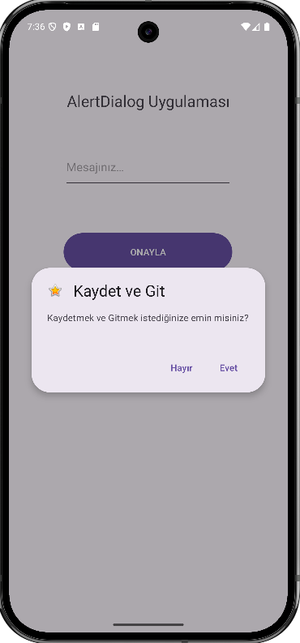
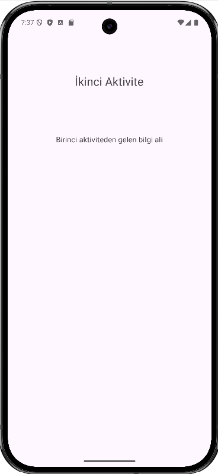

# AlertDialogApp2026

Bu proje, Android platformunda kullanıcı etkileşimini artırmak ve kritik işlemlerde onay almak için kullanılan **AlertDialog** (Uyarı Penceresi) bileşeninin kullanımını örneklemektedir. Eğitim amaçlı geliştirilmiştir.

## 🚀 Proje Hakkında

`AlertDialogApp2026`, modern Android geliştirme standartlarına uygun olarak kullanıcıya çeşitli geri bildirim pencereleri sunar. Uygulama içerisinde temel mesaj kutuları, onay mekanizmaları ve özelleştirilmiş diyalog yapıları yer almaktadır.

### Özellikler:

* **Basit Uyarılar:** Tek butonlu (Tamam) bilgilendirme mesajları.
* **Onay Diyalogları:** Evet/Hayır seçenekleri ile kullanıcıdan onay alma.
* **Seçimli Listeler:** Kullanıcının listeden seçim yapabildiği diyaloglar.
* **Özelleştirilmiş Tasarımlar:** Standart görünümün dışında, uygulamanın temasına uygun AlertDialog yapılandırmaları.

## 🛠 Kullanılan Teknolojiler

* **Dil:** Java / Kotlin (Proje içeriğine göre düzenlenebilir)
* **Platform:** Android SDK
* **UI Bileşenleri:** Material Design Components, AlertDialog Builder

## 📸 Ekran Görüntüleri

| Ana Ekran | Diyalog Penceresi | Sonç Ekranı |
|:---:|:---:|:---:|
|  |  |  |

## 📦 Kurulum ve Çalıştırma

Projeyi yerel makinenizde çalıştırmak için şu adımları izleyin:

1. **Repoyu Klonlayın:**
```bash
git clone https://github.com/bilisimeml/AlertDialogApp2026.git

```


2. **Projeyi Açın:** Android Studio'yu başlatın ve "Open" seçeneği ile indirdiğiniz klasörü seçin.
3. **Bağımlılıkları Yükleyin:** Gradle senkronizasyonunun tamamlanmasını bekleyin.
4. **Çalıştırın:** Bir emülatör veya fiziksel cihaz bağlayarak `Run` butonuna basın.

## 📖 Örnek Kod Kullanımı

Basit bir AlertDialog oluşturma örneği:

```kotlin
val builder = AlertDialog.Builder(this)
builder.setTitle("Uyarı")
builder.setMessage("Bu işlemi onaylıyor musunuz?")
builder.setPositiveButton("Evet") { dialog, which ->
    // Onaylandığında yapılacak işlemler
}
builder.setNegativeButton("İptal") { dialog, which ->
    dialog.dismiss()
}
builder.show()

```
## 📖 MaterialAlertDialog oluşturma
```kotlin
val builder = MaterialAlertDialogBuilder(this)
builder.setTitle("Silme İşlemi")
builder.setMessage("Bu dosyayı kalıcı olarak silmek istediğinizden emin misiniz?")

// Olumlu Buton
builder.setPositiveButton("Evet") { dialog, which ->
    // Silme işlemi kodları buraya
    Toast.makeText(this, "Silindi", Toast.LENGTH_SHORT).show()
}

// Olumsuz Buton
builder.setNegativeButton("Hayır") { dialog, which ->
    dialog.dismiss() // Diyaloğu kapat
}

// Diyaloğu oluştur ve göster
val alertDialog = builder.create()
alertDialog.show()
```

## 🤝 Katkıda Bulunma

1. Bu projeyi fork edin.
2. Yeni bir özellik dalı (branch) oluşturun (`git checkout -b feature/yeniOzellik`).
3. Değişikliklerinizi commit edin (`git commit -m 'Yeni özellik eklendi'`).
4. Dalınızı push edin (`git push origin feature/yeniOzellik`).
5. Bir Pull Request açın.

## 📄 Lisans

Bu proje [MIT Lisansı](https://www.google.com/search?q=LICENSE) ile lisanslanmıştır.

---

**Geliştirici:** [Bilişim EML](https://github.com/bilisimeml)  [Akif KORKMAZ](https://github.com/akifkorkmaz)

**Yıl:** 2026
